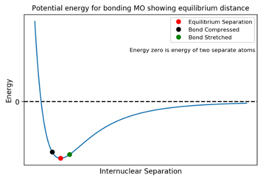
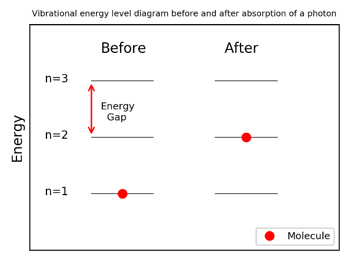

# Infrared Spectrscopy

## Introduction
You are likely to have encountered infrared (IR) spectroscopy at school in the context of characterising organic molecules but it is unlikely that it will have extended beyond identifying a particular type of bond (e.g. carbonyl C=O or hydroxyl O-H) and then suggesting the structure of the molecule.

We will develop this idea further by discussing how we can differentiate not just between different functional groups but between molecules with the same functional group (e.g. ester and ketone which both have the carbonyl C=O bond). 

The theoretical basis of infrared spectroscopy is largely beyond the scope of this course, However, only a relatively basic understanding of the theory is required to use IR for characterisation purposes.

The energy of a molecule can be separated out into translational, rotational, vibrational and electronic components which, to a first approximation, can be considered to be independent of each other. 

For each type of energy, there exist quantised energy levels. For example, a molecule can only have certain values of vibrational energy. If the energy of radiation incident on the molecule corresponds the energy gap between molecular energy levels, the molecule will absorb the radiation and be promoted to the higher energy level. It is important to remember that we are observing the transitions between energy levels, not the energy levels themselves. 

A common example is the black lines in the hydrogen absorption spectrum. The missing frequencies (colours) have energies equal to transitions between electronic energy levels. 

The energy difference between vibrational levels is in same area as the energy of infrared radiation on the electromagnetic spectrum. Therefore, when IR radiation is incident on a molecule, it may be able to cause a transition between vibrational energy levels. 

## Harmonic Approximation

A bond behaves like an oscillating spring, constantly increasing and decreasing in length. 

We saw in the MO course that the energy of bond as a function of nuclear separation had a minimum value (the equilibrium bond length) and that increasing or decreasing the bond raised the energy. As the bond lengthens, it deviates from the equilibrium bond length and it will experience a force trying to restore the equilibrium bond length much a like a spring when it is stretched or compressed. 
For small deviations from the equilibrium distance, we can model the potential as harmonic: the restoring force, 𝐹, is directly proportional to the distance the bond length is displaced from equilibrium, 𝑥.

 𝐹 = −𝑘𝑥

where 𝑘 is the the spring constant

## Energy Level Gaps

The frequency at which a spring oscillates depends on how stiff it is (the force required to produce a given extension or compression). This is quantified by the spring constant 𝑘 (measured in Nm-1). The harmonic oscillator approximation a bond as a massless spring with a mass 𝑚_1 attached to one end and a second mass 𝑚_2 attached at the other end. The angular frequency of oscillation is then:

 𝜔=√(𝑘/𝜇) 	where 𝜔=2𝜋𝑓 

where 𝜇 is the reduced mass 𝜇=(𝑚_1 𝑚_2)/(𝑚_1+𝑚_2 )

The frequency of oscillation of a the 𝑛^𝑡ℎ vibrational energy level is related to its energy.  

𝐸_𝑛=(𝑛+1/2)ℏ𝜔 ⟹𝐸_0=1/2 ℏ𝜔,𝐸_1=3/2 ℏ𝜔, 𝐸_2=5/2 ℏ𝜔…

⟹∆𝐸=𝐸_(𝑛+1)−𝐸_𝑛= 1/2 ℏ𝜔

where ℏ=ℎ/2𝜋 and ℎ is Planck’s constant

The important result is that energy difference between adjacent energy levels is the same for all levels. It turns out that transitions can only occur between adjacent energy levels. Therefore all transition for a particular molecule have the same energy / frequency. 

## Relationship to Incident Radiation

For a transition to occur, radiation with energy equal to the energy gap between vibrational energy levels ∆𝐸 must be be incident on the bond.

∆𝐸= 1/2 ℏ𝜔=1/2 ℏ√(𝑘/𝜇)

We can equate this to the expression for the energy 𝐸_𝑝 of a photon of frequency 𝑓_𝑝:

𝐸_𝑝=∆𝐸⟹ℎ𝑓_𝑝=1/2 ℏ√(𝑘/𝜇)⟹𝑓_𝑝=1/4𝜋 √(𝑘/𝜇)

Thus we arrive at the important result that the frequency of the photon absorbed when a vibrational transition occurs depends on the stiffness of the bond. For a real spring, 𝑘 depends on factors including the material of the spring, the wire width etc. In a chemical model, 𝑘 will depend on the strength of the bonding which will be different for different bonds (e.g. C=O vs. C-O) since the orbitals involved are different. Therefore, different functional groups will absorb photons with different frequencies 𝑓_𝑝. Comparing the frequencies absorbed by an unknown molecule to literature values allow us to then to identify functional groups in the molecule. For example, it is known that the carbonyl bond absorbs at a frequency of about 5.17×1013  Hz. 

## Wavenumbers

When working with IR spectra, the most common unit used to denote frequency is the non-S.I. wavenumber (cm-1). This is used since using Hertz or Joules produces very large and very small numerical values respectively whereas vibrational transitions tend to have wavenumbers in the range ~500 – 5000 cm-1. Wavenumber is the reciprocal of wavelength 𝜆 when the wavelength is measured in cm. Using the equation relating the speed of a wave 𝑐 (speed of EM radiation in cm s-1), wavelength and 𝑓, we arrive at any expression for calculating wavenumbers. 
𝑐=𝑓𝜆⟹1/𝜆=𝑓/𝑐

For example, a frequency of 5.17×1013  Hz in wavenumbers becomes:

1/𝜆=𝑓/𝑐=(5.17×1013)/(3×1010 )=1723" " cm-1

Note that as 1/𝜆∝𝑓 and energy 𝐸∝𝑓 ⟹𝐸∝1/𝜆 
In words, the higher the energy of transition, the greater the wavenumber. 

