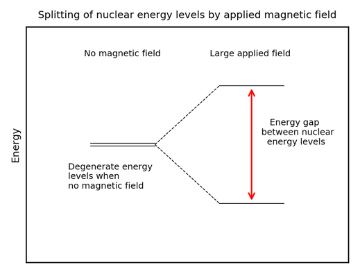

# Nuclear Magnetic Resonance

NMR is a very power spectroscopic tool. The full theory of NMR is complicated and beyond the scope of this course but a brief introduction is given here. 

## Introduction 
Some nuclei have multiple energy levels which are degenerate (of same energy) in the absence of a magnetic field. However, if we apply a strong magnetic field, we can split these energy levels and detect signals as the nuclei move between them. The precise energy (frequency) of these signals depends on multiple factors which provides information about the molecule under investigation.  

The condition for there to be multiple energy levels is for the nucleus to have a non-zero nuclear spin 𝐼. This nuclear spin is similar to the spin of an electron. For a nuclear spin of 𝐼 there are 2𝐼+1 nuclear energy levels. 13C and 1H, the most common nuclei you will encounter with NMR, have 𝐼=1⁄2 so 2 nuclear energy levels. For an element to be NMR active, it must have multiple nuclear energy levels. This requires a non-zero nuclear spin, 𝐼. 12C, the most abundant isotope of carbon has 𝐼=0 so is not NMR active. Other nuclei with higher values of nuclear spin will have more energy levels and produce more complicated NMR spectra. We will consider the 𝐼=1⁄2 , 2 energy level system here for simplicity. 

The first step is the application of a very large, homogeneous magnetic field which splits the previously degenerate nuclear energy levels – one is raised in energy and the other lowered in energy (see figure below). Like any physical system, the nuclei will seek the lowest energy state possible and occupy the lower nuclear energy level. Then irradiation by radio waves promotes nuclei up to the higher energy level. Once the irradiation ceases, the nuclei will de-excite (called “relaxing”) to the lower energy level, emitting radio waves. The precise frequency of the radio waves depends on the energy difference between the levels. 

We have discussed how the NMR process leads to the emission of radio waves but have not considered why the nuclei of the same element in different environments produce different radio frequencies. 

The energy difference between the nuclear energy levels depends on the local magnetic field. The asymmetric distribution of electron density across a molecule means the magnetic field experienced by a nucleus in one environment will be slightly different to that experienced by a molecule in another environment. Therefore, the energy difference between the nuclear energy levels will be different and the energy/frequency of the emitted radio waves will also different. Thus we can distinguish signals from different environments. 

Certain species like nearby electronegative elements and 𝜋 system and features like hybridisation state (sp3, sp2 etc) also affect the local magnetic field and therefore the frequency of the signal emitted. 

The energy gap which arises between nuclear energy levels when a particular magnetic field is applied is different for different elements.  

Therefore, the energy required to promote the nucleus from the lower to the higher level will vary between elements. 

By applying a specific radio frequency, we can target the nuclei of just one element and probe the number of environments and connectivity of that element. In other words, signals from 1H nuclei do not appear alongside signals from 13C nuclei. 

## Chemical Shifts

It is tempting to treat NMR machines as black boxes and assume they are perfect. However, science is rarely this simple and it is important to understand some of the challenges faced in recording NMR spectra. 

One of the biggest challenges in performing NMR is the generation of a homogeneous (same in all regions of a space) magnetic field to be applied to the sample. Spatial deviation of the magnetic field strength will lead to the nuclear energy levels splitting by different amounts and subsequent variations in the frequency of the radio waves emitted. Thus, nuclei in the same chemical environment might produce different signals, making analysis of the spectrum very difficult.

Modern NMR machines can produce a sufficiently homogeneous field but often struggle to produce a field of the same strength every time they generate one – the field strength will vary slightly each time. We therefore compare the radio wave frequency emitted by a nuclei in a particular environment to the frequency emitted by a reference chemical, often tetramethylsilane (TMS) with formula 〖Si(CH_3 )〗_4. We can therefore compare spectra measured under different applied magnetic fields since the frequency from the sample and reference will be affected by any variation in field strength by the same amount.

As previously mentioned, rather than stating the precise radio frequency emitted by a nucleus which will vary as the applied field varies day on day, we compare it to the frequency emitted by a nucleus in a reference compound. This comparison is quantified by the parameter called the chemical shift, 𝛿, which is normally expressed in parts per million:

𝛿=(𝑓_(𝑠𝑎𝑚𝑝𝑙𝑒 𝑛𝑢𝑐𝑙𝑒𝑢𝑠)−𝑓_(𝑟𝑒𝑓𝑒𝑟𝑒𝑛𝑐𝑒 𝑛𝑢𝑐𝑙𝑒𝑢𝑠))/𝑓_(𝑟𝑒𝑓𝑒𝑟𝑒𝑛𝑐𝑒 𝑛𝑢𝑐𝑙𝑒𝑢𝑠) ×10^6

In 1H NMR, 𝛿 takes values ~0.5-10 ppm and in 13C NMR 𝛿 takes values ~10-200 ppm. 

